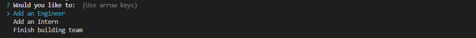
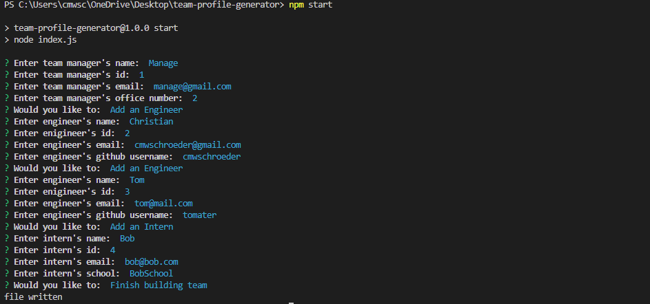
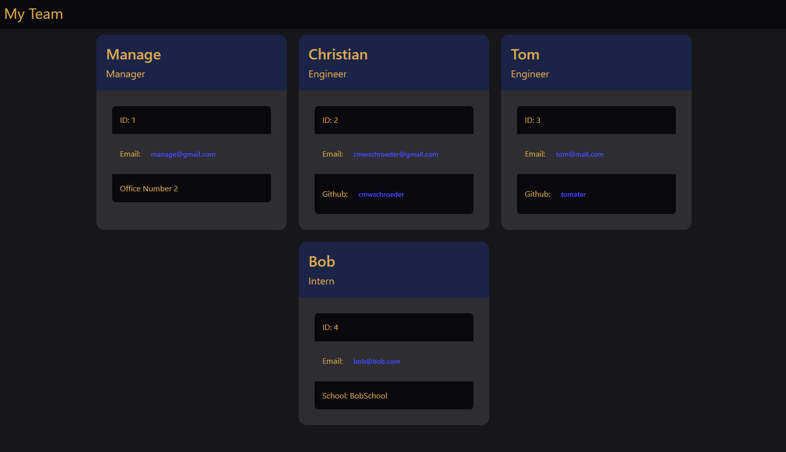

# Team Profile Generator

## Description

This program will build you a webpage featuring all of your team members. If you run this program you will be asked questions about your team members which you will answer. Your team will only be able to have a manager, and however many engineers and interns that you want. On completion of this program a webpage will be written that will show you information on all the team members you wished to add. All of these will have email links that allow for easy clicking to start an email to this team member, engineers will also have links to their github.

## Table of Contents

* [Technologies](#technologies)
* [Installation](#installation)
* [Test](#test)
* [Usage](#usage)
* [Questions](#questions)
* [License](#license)

## Technologies

| Technology | Link |
| -------- | ------|
| HTML |   |
| Javascript |    |
| Node.js | https://nodejs.org/en/ |
| npm | https://www.npmjs.com/ |
| Inquirer | https://www.npmjs.com/package/inquirer |
| Tailwind |  https://tailwindcss.com/  |
| DaisyUI | https://daisyui.com/ |

## Installation

npm install

## Test

To run the test files type in your console while in the program directory: npm test

## Usage

To start the program type into your console while in the program directory: npm start

This will start the program and start asking questions to build your team. You will first be asked questions about the team manager, there is no option to not have a team manager. After the questions for the team manager have been asked you will be brought to a menu that will ask if you want to add an engineer, add an intern, or finish building your team.  

Picture of the menu:

  

If you select either adding an engineer or intern you will be asked questions about this team member, and when you are done answering you will again be brought back to the menu. You can keep doing this until all team members are added.  

Once all members have been added you can finish by selecting the finish building your team option. Then an index.html file will be added into the dist folder of the directory. On this file will be all of the info you wrote about your team members. Each email will be able to be clicked on and you will be brought to your default email program with the To section filled in with the email. Each github username will also be able to be clicked on and you will be brought to that github users page.  

Example inputs:  

  

Example page created from inputs:  

  

Link to video showing usage: https://www.youtube.com/watch?v=YvlRWNYMtF4

## Questions
If you have any questions you can reach me at:  
Github: cmwschroeder  
Github link: https://github.com/cmwschroeder  
Email: cmwschroeder@gmail.com

## License

Licensed under the [MIT License](LICENSE)